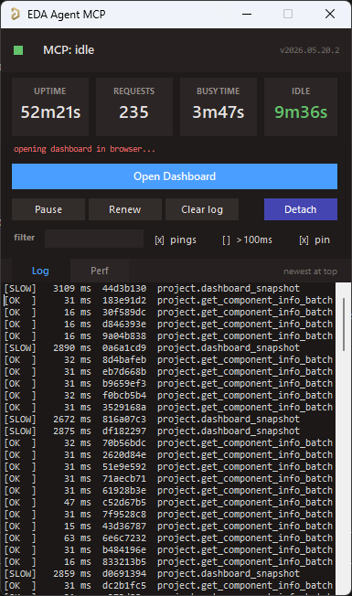

# eda-agent

MCP server that lets an AI (or any MCP-compatible client) **interact with a live Altium Designer session**. It exposes 300+ tools covering schematic, PCB, library, project, and design-agent operations over a persistent DelphiScript bridge. The AI reads the design you currently have open, asks questions about it, and can modify it in place while you watch.

> **⚠️ Experimental.** Not all tools are extensively tested. Some can crash the Altium DelphiScript engine. See [Known limitations](#known-limitations) before using on any design you haven't backed up.

## Demo

Claude Code reviewing a buck converter through eda-agent. The feedback resistor divider on this schematic is intentionally wrong; Claude catches it among other recommendations.

[](https://youtu.be/snRyCx3OlxM)

## Dashboard



Two dashboards ship with eda-agent:

- **In-Altium status window** — a floating Altium-side window showing live status, request count, cumulative Altium-side time, auto-shutdown countdown, and a per-command log with durations. `Hide pings` filters the 30 s keep-alive traffic; `Only >100ms` isolates slow calls. The **Detach** button saves all dirty docs and exits the polling loop cleanly.
- **Web dashboard** — a local browser dashboard at `http://127.0.0.1:8766`, focused on design review. A **Review** tab surfaces datasheet / MPN / manufacturer / footprint coverage gauges and an actionable issue queue (missing datasheet, missing MPN, orphan nets, ...); **Project**, **Components**, **Nets**, **Libraries** and **Plan** tabs give live structured views. Click any component or net to drill into a detail drawer; one click cross-probes it into Altium. Light / dark theme, server-sent-events live feed. It is auto-started by the MCP server — the **Open Dashboard** button on the in-Altium status window launches the browser.

## How it works

- Altium Designer stays open and in full control of your design
- A DelphiScript polling loop runs inside Altium's scripting engine
- `eda-agent` (Python, launched by your MCP client) sends commands via file-based IPC
- Altium executes, writes a response, and returns to polling
- You see the changes happen live in Altium

This is **not** a batch tool that opens a project, runs a script, and exits. It's a live connection for as long as you want it (conversational design review, guided refactoring, ad-hoc BOM queries, "what nets does this resistor connect to?"), all on the project you currently have open.

## Features

- **300+ tools** across application, project, library, schematic/general, PCB, and design-agent categories
- **Generic primitives** (`obj_query`, `obj_modify`, `obj_create`, `obj_delete`, `run_process`) that work on almost any schematic or PCB object type via late-binding, avoiding per-type handler proliferation
- **Bulk batch primitives**: `obj_batch_modify`, `obj_batch_create`, `obj_batch_delete`, `pcb_place_tracks`, `pcb_move_components`, `sch_place_wires`, `place_net_labels`, `place_power_ports`, `sch_place_components`, `sch_set_components_parameters`, `get_sch_doc_pins`, `lib_add_pins`, `proj_get_connectivity_many`, `sim_attach_primitives`. Collapse N LLM turns + N IPC round-trips into one. Typical wall-time savings: 10 to 100x on multi-item edits
- **Design review snapshot**: `design_review_snapshot` bundles 8 to 12 review reads (project info, components, nets, rules, diff, messages, stats, unrouted, BOM) into a single call. One LLM turn instead of a dozen
- **Design-lint sweep**: `design_lint_report` runs 31 audit checks in one IPC pass and returns a structured violation list — schematic-side (component-parameter visibility per class, power-port orientation, floating ports, multi-output / no-driver nets, duplicate designators, off-grid components) and PCB-side (DNP variant components, tented-via ratio, near-miss track endpoints, signal vias without nearby return via, via antennas, removed pad shapes, components outside outline, pads too close to board edge, invalid polygon regions, optional DRC). Each check is also exposed as a standalone `audit_*` MCP tool; the dashboard's Status → Health subtab has a one-click Lint panel that calls `/api/lint` and groups results by Schematic / PCB
- **Datasheet-first discipline**: every component-surfacing response (`pcb_get_components`, `proj_get_bom`, `proj_get_component_info`, `proj_find_component`, `lib_search`, `design_review_snapshot`, `sim_get_readiness`) carries a `_datasheet_guidance` block with per-part vendor search queries. `app_attach` / `app_ping` carry a `_system_reminder` so every MCP client that connects sees the rule at session start. LLM-fabricated datasheet values are forbidden; WebFetch/WebSearch are called out by name
- **Sch <-> PCB netlist crossref**: `crossref_net(net_name)` compares the schematic pin list against the PCB pad list for the same net. Catches ECO drift, stale post-fabrication routing, phantom nets from port/sheet-entry rename conflicts. `in_sync` flag + `sch_only` / `pcb_only` diff
- **SPICE simulation workflow**: `sim_get_readiness` audits every component and partitions into ready / needs-primitive / needs-file. `sim_attach_primitives` sets SpicePrefix + Value on passives. `sim_attach_model` links a vendor `.mdl` / `.ckt`. `sim_run` dispatches the simulator. Built-in guardrail: never fabricate a SPICE model file, fetch the vendor one
- **Focus-independent PCB access**: every PCB handler falls back to `GetPCBBoardByPath` when `GetCurrentPCBBoard` returns nil (user has a sch tab focused). No more misleading "No PCB document is active" when the PCB is right there
- **Fast and compile-cached**: persistent polling loop; ~10 ms per call in active mode. `SmartCompile` caches `DM_Compile` with a 2 s TTL so a multi-read review pays for one compile instead of a dozen. Explicit `proj_force_recompile` + `proj_get_compile_freshness` probes for cases that need a guaranteed-fresh netlist (e.g. after user edits)
- **Persistent polling loop**: one script start, then ~10 ms per tool call in active mode
- **Annotation runs silently**: `proj_annotate` designates components without popping the annotate dialog
- **Deferred save for speed**: mutations mark documents as modified in memory; disk writes happen on explicit `app_save_all` (or automatically on `app_detach`). Before this, every edit triggered a full project save, which dominated latency
- **Two dashboards**: an in-Altium floating status window (status, request count, per-command performance, command log, Detach button) and a browser-based **web dashboard** (`127.0.0.1:8766`) for design review — datasheet / MPN / footprint coverage gauges, an actionable issue queue, component / net drill-in, one-click cross-probe into Altium, light / dark theme. The whole project view loads in one bundled IPC round-trip (`project.dashboard_snapshot`); the web dashboard auto-starts with the MCP server
- **DelphiScript trap linter**: `scripts/altium/lint.py` (wired into `build.py`) scans the Pascal sources for known parser hazards — `Cardinal()` casts, malformed hex literals, empty `.Add('')` arguments, braces inside comments, fixed-size arrays as function locals, reserved-word identifiers — and fails the build before a bad deploy
- **Activity logs**: every command is appended to `workspace/activity.log` (CSV with timestamps, durations, command name, response size). The bridge also writes `bridge_trace.log` for IPC-level diagnostics
- **Bulk-tool nudge**: when a singular tool is hit 2 to 3 times in 10 s, the response carries a `_hint_bulk` field pointing at the batch variant. Clients that missed the bulk tool in the docstring learn about it at runtime
- **Design agent surface**: six MCP tools (`design_get_discipline`, `design_snapshot_inventory`, `design_validate_plan`, `design_execute_plan`, `design_audit_schematic`, `design_validate`) that let an MCP-client LLM produce a structured `DesignPlan` JSON, instantiate it on a fresh sheet (parts + wires + labels + rail glyphs), audit the result for layout problems, and validate ERC + connectivity. Datasheet-first, NDA-isolated by construction
- **Motif composer + canonical priors + Sugiyama placement**: three-layer placement strategy. (1) Sugiyama / force-directed gives every part a baseline position. (2) The motif composer detects canonical sub-circuits in the netlist (bypass cap, voltage divider, fb_divider, lc_output, ...) via VF2 subgraph isomorphism and splats each match into its frozen canonical layout — same data shape, IC-anchored or self-contained. (3) Canonical priors apply per-role-pair nudges (e.g. `vcc_decoup` sits 400 mils from its IC). A final overlap-shove pass repairs any collisions; sheet-edge clamping keeps every glyph and port within the page boundary. Role-compatibility filter drops false-positive motif matches (a structural rc-lowpass that's actually a decoupling cap stays out of the filter motif). Topology-agnostic — works for a buck, an LDO, an MCU, an audio amp, anything with a clean net graph
- **Within-block schematic wiring**: stub wires from each pin endpoint outward to the label / port (no more "floating net labels" ERC warnings), Manhattan routing between same-net pins for signal nets, **rail consolidation** clusters power / ground pins so one VCC bar or GND triangle serves many pins instead of stacking N glyphs. Obstacle-aware: every L-path picks the orientation that crosses fewest component bodies, using real `BoundingRectangle` data queried from Altium
- **Atomic-parts contract**: every existing-status Part must carry `mpn`, `footprint`, `datasheet_url`; the inventory snapshot exposes those fields per component; `design_validate` emits `atomic_parts` warnings when the contract is missed. Aligns with the KiCad Atomic / Digi-Key Library / atopile / JITX convention
- **Schematic audit**: `design_audit_schematic` returns structured `{overlaps, wire_crossings, stacked_ports}` for the active schematic — pairs of components whose bboxes intersect, wire segments crossing a non-endpoint component body (real Pascal-side `Vertex.*` + `BoundingRectangle.*` accessors), and clusters of 3+ rail glyphs of the same net. Each violation carries enough geometry for the planner to compute a corrective move. Programmatic feedback loop without needing a visual snapshot
- **Health and doctor preflight**: `eda-agent health` (offline checks: workspace dir, pointer file, bundled scripts) and `eda-agent doctor` (full preflight talking to Altium: process running, script polling responsive, version match, save_all canary, optional `--library` lib-path checks). `--json` for machine-readable output
- **pip-installable**: no admin, no installer, no touching Altium's config

## Requirements

- Windows (Altium Designer is Windows-only)
- Python 3.11+
- Altium Designer (recent versions, AD20+ preferred)

## Installation

```bash
git clone https://github.com/salitronic/eda-agent
cd eda-agent
pip install -e .
```

Register the server with your MCP client. The binary is `eda-agent` and runs on stdio; consult your client's docs for how to add a local stdio-based server.

### Claude Code

```bash
claude mcp add altium eda-agent
```

Adds `eda-agent` as an MCP server named `altium` to your Claude Code project config. Use `-s user` to register it at the user level (available across every project):

```bash
claude mcp add -s user altium eda-agent
```

If `eda-agent` isn't on your `PATH`, give the full path instead (pip reports it after install, typically `%USERPROFILE%\AppData\Roaming\Python\Python312\Scripts\eda-agent.exe` on Windows). To verify the connection: `/mcp` in a Claude Code session should list `altium` as connected.

### Other MCP clients

The server speaks standard MCP over stdio; any client that accepts a local stdio command will work. Invoke `eda-agent` (or `eda-agent serve`) as the subprocess.

### Altium-side scripts

Drop the Altium script project somewhere you can find it:

```bash
eda-agent install-scripts
```

Default destination: `%USERPROFILE%\EDA Agent\scripts\`. Use `--dest PATH` to put it elsewhere.

Register the script as a Global Project in Altium (once):

1. **DXP → Preferences → Scripting System → Global Projects** → **Install from file**
2. Select the `Altium_API.PrjScr` you just installed

From then on, every Altium startup compiles the script project and the polling loop is one click away:

1. **File → Run Script...**
2. Expand `Altium_API` → `Dispatcher.pas`, select **StartMCPServer**, click **Run**

The polling loop starts and your MCP client can drive Altium.

> If you'd rather not register the script globally, you can also open `Altium_API.PrjScr` via **File > Open...** and launch `StartMCPServer` from the **Run Script...** dialog the same way; the dialog picks up any loaded script project.

## Example use cases

### Full-project design review

> *"Do a design review of the PoE front-end. Pull the snapshot, fetch the TPS2372 and TL072 datasheets, and flag anything that doesn't match."*

One `design_review_snapshot` call gives the AI project info, design stats, components, nets, rules, diff, messages, board stats, and BOM, plus a datasheet-fetch checklist. The AI then grounds every recommendation in the vendor datasheets it actually pulled. 8 to 12 separate queries collapse into one tool call.

### Schematic review

The AI reads your schematic live. Ask it anything a reviewer would:

> *"List every component connected to the 3V3 rail and flag anything whose datasheet limit is below that."*
>
> *"Find all net labels that appear only once across the whole project. Those are probably typos."*
>
> *"What's driving the /RESET net? Walk the connectivity and tell me where it resets and how."*
>
> *"Do any two components share a designator prefix with gaps in numbering (e.g. R1, R2, R4)? Re-annotate or tell me what's missing."*
>
> *"Compare the focused schematic to the version from 3 weeks ago. What parameter values changed?"*

Under the hood, the AI calls tools like `query_objects(object_type="eSchComponent", scope="project")`, `get_connectivity_many(designators=[...])`, `get_nets(...)`, `modify_objects(...)`, and so on. You watch Altium repaint as it works.

### Sch ↔ PCB drift detection

> *"Run `obj_crossref_net` on POE_PG. The PCB seems to have R7 on this net but I'm not sure the schematic still does."*

The response shows sch pins, PCB pads, matched count, and the diff in each direction. A non-empty `pcb_only` list means the board was fabricated from an earlier schematic revision and a later edit broke the post-ECO merge; catch this before the next ECO push rips routed connections. `in_sync: false` plus the exact diff tells you which port or sheet-entry rename to undo.

### SPICE simulation setup

> *"Set this schematic up for an AC sweep. Attach SPICE primitives to every passive, fetch vendor SPICE models for the op-amps, and tell me if any part can't be simulated."*

`sim_get_readiness` partitions the design into `ready` / `needs_primitive` / `needs_file`. The AI batches primitives onto every passive in one `sim_attach_primitives` call, searches vendor sites for the IC models, attaches them with `sim_attach_model`, and reports any holdouts. It will not fabricate a SPICE model file; the rule is baked into the tool response.

### Library hygiene

> *"Open `Resistors.SchLib` and report every component missing a Value, ManufacturerPart1, or Description parameter. Fill in the missing Description from the datasheet URL if present."*
>
> *"Diff our `Caps.SchLib` against `Caps_vendor.SchLib` and tell me what's new or changed."*
>
> *"Create a new 48-pin symbol for STM32F411 with this pinout table."*

The last one uses `lib_add_pins`: one call places the whole pinout in a single transaction instead of 48 LLM turns.

### PCB spot-checks

> *"Any unrouted nets on the board?"*
>
> *"What's the total trace length for the USB differential pair, split by layer?"*
>
> *"Show me all vias on the 12V net and their drill sizes."*
>
> *"Run DRC and summarize the violations by severity."*
>
> *"What does the `Clearance_HV` rule actually enforce: clearance value, scope expressions, priority?"*

That last one uses `pcb_get_rule_properties`, which returns the actual numeric gap / widths / impedance targets, not just rule metadata.

### Bulk changes

> *"Every 0402 resistor with value 10k, set its Tolerance parameter to 1% and Voltage to 50V."*
>
> *"Rename the net OLD_CS to SPI_CS across every sheet in the project."*
>
> *"Move C1–C20 into this 200-mil grid layout pattern."*

Bulk tools like `obj_batch_modify`, `pcb_move_components`, and `sch_place_components` finish the whole operation in one IPC round-trip.

## Known limitations

**This tool is experimental. Please read this section before using on a design you haven't backed up.**

### Altium DelphiScript engine can crash

Some tool paths trigger DelphiScript compile or runtime errors ("Undeclared identifier…", "Could not convert variant of type (Dispatch) into type (OleStr)", etc.). When that happens, the script project halts mid-execution and the polling loop stops responding. You will see one of:

- An Altium error dialog stating the problem
- Your MCP client timing out waiting for a response

**Recovery:** in Altium Designer, open the script project tab and press the **red Stop** button in the Script IDE toolbar (equivalently **Run > Stop** from the menu, or **Ctrl+F3**; use **Ctrl+Pause/Break** if the script is stuck in an infinite loop). This stops the halted debugger. Then re-launch the polling loop via **File > Run Script... > StartMCPServer > Run**.

This is an ongoing reliability effort. Every identified crash is either fixed or guarded. If you hit a new one, the Altium error dialog tells you the exact identifier or line. Opening an issue with that text helps us harden the relevant path.

### Altium tool buttons relying on internal scripting pause while the server is running

Altium itself uses DelphiScript internally for many built-in commands (some ribbon buttons, panel actions, menu items). **While the `eda-agent` polling loop is active, those built-in commands may become temporarily unresponsive** because Altium's scripting engine is single-threaded and currently owned by our polling loop.

**The polling loop owns the scripting engine for as long as it's running.** While it runs, Altium's own script-backed buttons sit waiting. The loop exits when either:

- The MCP client calls `app_detach` (or the dashboard **Detach** button is clicked); the loop saves all dirty docs, exits within ~500 ms, and Altium becomes fully responsive, OR
- **10 minutes of total silence** from the MCP client (no commands AND no keep-alive pings) triggers the built-in auto-shutdown

In practice, while an MCP client is attached and sending keep-alive pings every 30 s, the loop will never time out on its own; you need to either have the AI call `app_detach` or close the MCP client session entirely. After the client disconnects, expect up to ~10 minutes for the loop to auto-exit unless you use **Detach** to release it immediately.

### ECO (sch → PCB update) is not reliably scriptable

`proj_sync_pcb` wraps `RunProcess('PCB:UpdatePCBFromProject')`. On some Altium builds this runs silently without applying changes; on others it pops the modal ECO dialog. The Altium Schematic API doesn't expose a fully scripted ECO executor: `IECO` only records proposed changes, no `DM_Execute` method is documented, and no factory is exposed for obtaining an `IECO` instance from a script.

**Practical workflow:** call `proj_sync_pcb` and check the result's `components_added_to_pcb` count. If it's zero while `in_sync` is `false`, open the PCB in Altium and run **Design → Import Changes From …** yourself. Once the dialog is dismissed, every other tool (`pcb_move_components`, `pcb_place_tracks`, `pcb_run_drc`, etc.) works normally.

### Tools vary in maturity

Not every one of the 300+ tools has been exercised on every Altium version or design size. The [generic primitives](#generic-primitives-the-core) and the core `application` / `project` tools are the best-tested. Some PCB modify operations (polygon repour, room creation, align-components) are less battle-tested. Queries are generally safer than mutations.

## Timeout and server lifecycle

The server has **three independent timeout mechanisms**:

### 1. Per-command timeout (Python side)

When the MCP client calls a tool, the Python bridge writes a request file and waits up to **10 seconds by default** for a response. Fast queries typically complete in under 100 ms, so a 10 s ceiling surfaces stalls quickly while leaving plenty of margin for real work. Long-running tools that are expected to take longer (`app_save_all`, `stop_server`, `pcb_get_unrouted_nets`) set their own larger timeouts internally.

Each request is published to its own `request_<id>.json` file; Altium replies in `response_<id>.json` with the matching ID. The bridge's keep-alive thread and MCP-client calls each use their own request IDs, so responses never race. The older single-`response.json` channel was retired in IPC v2.

### 2. Server auto-shutdown (Altium side)

The DelphiScript polling loop auto-stops after **10 minutes of inactivity** (`AUTO_SHUTDOWN_MS = 600000`). If the MCP client disconnects and the keep-alive pings stop arriving, the server releases Altium's scripting engine after ten minutes and `StartMCPServer` returns. To resume, re-launch via **File → Run Script... → StartMCPServer → Run**.

### 3. Python keep-alive pings

While an MCP client is attached, the Python bridge pings Altium every 30 seconds so the 10-minute auto-shutdown never fires mid-session. The sequence:

- **AI issues command A** → Altium busy, then idle
- **30 s later, Python pings** → Altium responds "pong", idle timer resets
- **10 min later, still no AI activity and no ping** → Altium auto-shuts down

In practice: the server stays alive as long as an MCP client is connected, and exits cleanly ~10 minutes after the client fully disconnects. No manual stop needed in the common case. For a hard exit, the AI (or the **Detach** button on the dashboard window) calls `app_detach`, which persists any unsaved work via `app_save_all` and returns control to Altium within ~500 ms.

### Why this matters for Altium UI responsiveness

The polling loop goes into idle mode after ~1 second of no MCP commands. In idle mode it polls every 100 ms with a `ProcessMessages` yield in between, so Altium's UI stays responsive continuously. In active mode the loop polls every 10 ms (`ProcessMessages` every 5th tick), giving sub-50 ms round-trip latency for back-to-back commands. For a full release, call `app_detach` or click **Detach** on the dashboard.

## Tool reference

300+ tools grouped into six categories. The **generic primitives** are the engine; the rest are convenience wrappers or category-specific operations.

### Generic primitives (the core)

These six tools cover most day-to-day work. They accept any object type supported by the bridge.

| Tool | Purpose |
|---|---|
| `obj_query` | Read properties from schematic or PCB objects, with filter and scope |
| `obj_modify` | Set properties on matching objects |
| `obj_create` | Create and place a new object |
| `obj_delete` | Delete matching objects |
| `obj_batch_modify` | Apply many modify operations in one IPC round trip |
| `obj_run_process` | Execute any Altium process command with keyed parameters |

**Supported schematic object types:** `eNetLabel`, `ePort`, `ePowerObject`, `eSchComponent`, `eWire`, `eBus`, `eBusEntry`, `eParameter`, `ePin`, `eLabel`, `eLine`, `eRectangle`, `eSheetSymbol`, `eSheetEntry`, `eNoERC`, `eJunction`, `eImage`.

**Supported PCB object types:** `eTrackObject`, `eViaObject`, `ePadObject`, `eComponentObject`, `eArcObject`, `eFillObject`, `eTextObject`, `ePolyObject`, `eRuleObject`, plus selection and design-rule classes.

**Scope values:** `active_doc`, `project`, `project:<path>`, `doc:<path>`.

### Application (16 tools)

| Tool | Purpose |
|---|---|
| `app_get_status` | Is Altium running? Version / PID / attached state |
| `app_attach` | Verify connection to the running instance |
| `app_detach` | Save all dirty docs, signal server shutdown, release scripting engine |
| `app_save_all` | Flush every modified document to disk (explicit checkpoint for the deferred-save model) |
| `app_ping` | Test the polling loop is responsive; reports script version + mismatch with bundled |
| `app_list_documents` | List every open document with `loaded` flag (sch, pcb, lib, outjob…) |
| `app_get_active_document` | Which document currently has focus |
| `app_set_active_document` | Switch focus to an already-loaded document by path |
| `app_create_document` | Create a blank PCB / SCH / library / OutJob document and attach to the focused project |
| `app_get_version` | Build / product version string |
| `app_get_preferences` | Snap grids, unit system, common prefs |
| `app_run_menu` | Run a menu command by path (e.g., `Tools|Design Rule Check`) |
| `app_get_clipboard` | Read text from Windows clipboard |
| `app_diag_workspace` | Diagnostic: enumerate the IPC workspace directory and report pending request files. Useful when investigating IPC plumbing |
| `app_set_intent` | Record the current conversation's intent so the web dashboard can display what the agent is working on |

### Project (53 tools)

Lifecycle, parameters, compilation, analysis, outputs, ECO sync, variants.

| Tool | Purpose |
|---|---|
| `proj_create` / `proj_open` / `proj_save` / `proj_close` | Project lifecycle |
| `app_save_all` / `proj_get_focused` / `proj_list_open` / `proj_get_path` | Project state |
| `proj_list_documents` / `proj_add_document` / `proj_remove_document` / `proj_import_document` | Document management |
| `proj_load_sheets` | Force every SCH sheet of the focused project into the editor so `scope=project` queries hit them |
| `proj_get_parameters` / `proj_set_parameter` / `proj_set_document_parameter` | Parameters |
| `proj_push_parameters` | Copy all project parameters onto each loaded sheet (title-block fields) |
| `proj_get_options` | Compiler / variant / channel settings |
| `proj_compile` / `proj_get_messages` | Compile and read violations |
| `proj_get_stats` / `proj_get_differences` / `proj_get_board_info` | Design analysis |
| `proj_get_bom` / `proj_get_nets` / `proj_get_component_info` / `proj_get_component_info_many` / `proj_get_connectivity` / `proj_find_component` | Design queries (`proj_get_component_info_many` is the bulk variant) |
| `proj_cross_probe` / `proj_lock_designator` / `proj_annotate` | Designator management |
| `proj_compare_sch_pcb` / `proj_sync_pcb` / `proj_sync_schematic` | ECO sync (see [ECO limitation](#eco-sch--pcb-update-is-not-reliably-scriptable)) |
| `proj_get_connectivity_many` | Pin-net connectivity for many designators in one round-trip (bulk) |
| `proj_force_recompile` / `proj_get_compile_freshness` | Explicit SmartCompile cache control: save all dirty docs, invalidate, recompile; report cache age + dirty-in-editor docs |
| `proj_list_variants` / `proj_get_active_variant` / `proj_set_active_variant` / `proj_create_variant` | Variant management |
| `proj_export_variant_matrix_csv` / `proj_print_all_variants` | Variant outputs: the fitted/not-fitted matrix CSV (merges with a BOM), and one PDF per variant |
| `proj_export_pdf` / `proj_export_step` / `proj_export_dxf` / `proj_export_image` / `proj_run_output` | Output generation |
| `proj_list_outjob_containers` / `proj_run_outjob` / `proj_run_outjob_all` | OutJob execution (`proj_run_outjob_all` fires every container in one pass) |
| `proj_generate_fab_package` | Run every OutJob container (Gerber / NC drill / IPC-356 / P&P / assembly / BOM) and return a consolidated manifest of produced files; optional STEP / DXF |

### Library (36 tools)

Symbol and footprint creation, linking, batch editing, comparison.

| Tool | Purpose |
|---|---|
| `lib_create_symbol` / `lib_copy_component` / `lib_set_component_description` / `lib_set_current_component` | Symbol lifecycle. `lib_set_current_component` switches the SchLib editor's active component so subsequent generic-primitive calls (`obj_modify` on pins / rect / parameters) target the named symbol rather than whatever was last UI-selected |
| `lib_add_pins` / `lib_get_pin_list` | Pins (places the whole pinout in one call) |
| `lib_add_symbol_rectangle` / `lib_add_symbol_lines` / `lib_add_symbol_arc` / `lib_add_symbol_polygon` | Symbol graphics. Coordinates auto-snap to the 100-mil grid. `lib_add_symbol_lines` does N lines in one IPC round-trip for diode glyphs / op-amp triangles / connector outlines |
| `lib_create_footprint` | Footprint creation |
| `lib_add_footprint_pad` / `lib_add_footprint_track` / `lib_add_footprint_arc` | Footprint primitives |
| `lib_link_footprint` / `lib_link_3d_model` | Link footprint / 3D model to symbol |
| `lib_get_components` / `lib_get_component_details` / `lib_search` | Browse and search |
| `lib_batch_set_params` / `lib_batch_rename` | Bulk parameter / rename operations |
| `lib_diff_libraries` | Compare two libraries |
| `lib_update_footprint_heights_from_3d` | Propagate `IPCB_ComponentBody.OverallHeight` up to `Footprint.Height` so placement-collision DRC actually fires (libraries from vendors often ship Height=0) |
| `lib_inspect_cse_zip` / `lib_extract_cse_zip` | SamacSys / Component Search Engine zip import: identify the .SchLib / .PcbLib / STEP members (and any path-traversal members — those reject the whole archive), then stage the files and return an ordered install plan of `lib_install_library` / `lib_link_footprint` / `lib_link_3d_model` calls. Extraction is pure Python |

### Schematic and general (93 tools)

Schematic-side operations plus viewport and sheet management.

| Tool | Purpose |
|---|---|
| `obj_query` / `obj_modify` / `obj_create` / `obj_delete` / `obj_batch_modify` | Generic primitives (see above) |
| `obj_select` / `obj_deselect_all` | Selection state |
| `obj_zoom` / `obj_switch_view` / `obj_refresh_document` | Viewport |
| `obj_highlight_net` / `obj_clear_highlights` | Net highlighting |
| `proj_run_erc` / `proj_get_unconnected_pins` | Electrical rules check |
| `proj_add_sheet` / `proj_delete_sheet` / `sch_get_sheet_parameters` / `obj_get_document_info` | Sheet management |
| `sch_place_wires` / `sch_place_bus` / `sch_place_net_label` / `sch_place_port` / `sch_place_power_port` | Schematic placement |
| `sch_place_sheet_symbol` / `sch_place_sheet_entry` / `sch_place_bus_entry` | Hierarchical sheet primitives |
| `sch_place_components` | Instantiate one or more components from an SchLib at (x,y) with rotation and designator override |
| `sch_set_sheet_size` | Change SheetStyle (A / A0–A4 / Letter / Legal / Custom) |
| `sch_place_no_erc` / `sch_place_junction` / `sch_place_image` / `sch_place_note` / `place_directive` | Markers, annotations, directives |
| `sch_place_rectangle` / `sch_place_line` | Graphical primitives |
| `obj_copy` / `obj_count` / `proj_replace_component` | Bulk operations |
| `obj_set_grid` / `sch_set_units` | Change snap / visible grid / UnitSystem (mm ↔ mil) |
| `obj_get_font_spec` / `obj_get_font_id` | Font table lookup |
| `obj_batch_create` / `obj_batch_delete` | Generic bulk create / delete meta-tools |
| `sch_place_wires` | Place many wire segments in one IPC round-trip |
| `sch_place_components` | Bulk BOM placement: library_path + lib_ref + x/y/rotation per entry |
| `sch_add_directive` / `sch_get_directives` | Parameter-set directives (diff pair tags, net class, custom rules) |
| `sch_place_harness_connector` / `sch_place_cross_sheet_connector` | Harness bundles + hierarchical off-sheet ports |
| `sch_place_text_frame` / `sch_increment_designators` / `sch_toggle_pin_visibility` | Multi-line note frames, bulk designator renumber, pin-label visibility |
| `sch_place_probe` | SPICE / simulation measurement node |
| `sch_set_component_part_id` | Switch active sub-part on a multi-gate symbol (U1A ↔ U1B) |
| `sch_add_datafile_link` | Attach IBIS / SPICE model / CSV to a component's implementation |
| `sch_get_constraint_groups` | Enumerate `DM_ConstraintGroups` (FPGA-style pin/timing constraints) |
| `sim_get_readiness` / `sim_attach_primitives` / `sim_attach_model` / `sim_run` | SPICE workflow: audit, attach, simulate |
| `design_review_snapshot` / `design_datasheet_checklist` | One-call full-project review + datasheet discipline |
| `design_lint_report` | One-call run of all `audit_*` checks (component params, port direction, designator collisions, off-grid, tented vias, near-miss tracks, via antennas, removed pad shapes, off-board components, edge clearance, single-pin nets, MPN inconsistencies, ...) returned as a grouped violation list |
| `audit_*` (31 tools) | Individual design-lint checks; each returns `{checked, violations, items[]}`. Wired into `design_lint_report` and the dashboard's Status → Health → Design lint panel via `/api/lint` |
| `obj_crossref_net` | Sch pin list vs PCB pad list for a named net: diff + `in_sync` flag |
| `obj_run_process` | Run any Altium process command |

### PCB (104 tools)

Queries and modifications on the active PCB document.

| Tool | Purpose |
|---|---|
| `pcb_get_nets` / `pcb_get_net_classes` / `pcb_create_net_class` | Net / net class management |
| `pcb_focus_board` | Make a specific .PcbDoc the focused board so all the GetPCBBoardAnywhere-based tools target it (needed when several PcbDocs are open; `app_set_active_document` doesn't reliably set the current PCB) |
| `pcb_delete_net` | Remove nets — by default only empty ones (cleanup for stray nets left after deleting components); `force` to delete connected nets too |
| `pcb_get_design_rules` / `pcb_create_design_rule` / `pcb_delete_design_rule` / `pcb_get_diff_pair_rules` / `pcb_get_room_rules` | Design rules. `pcb_create_design_rule` dispatches to typed `IPCB_*Constraint` subtypes for clearance / width / via-size with the proper per-layer setters |
| `pcb_get_rule_properties` / `pcb_set_rule_properties` | Read rule metadata + the `descriptor` string (which carries every constraint value in human-readable form, e.g. `Width Constraint (Min=0.102mm) (Max=5.08mm) (Preferred=0.127mm)`); set metadata-only (Enabled / Priority / Scope1 / Scope2 / Comment). Constraint values must be set via `pcb_create_design_rule` or the Altium UI; they live on per-kind subtypes that DelphiScript cannot dispatch to safely from a base `IPCB_Rule` reference |
| `pcb_set_rules_enabled` | Bulk DRC-rule enable/disable by name pattern |
| `pcb_run_drc` / `pcb_get_clearance_violations` | Run DRC and read back enriched violations (each with x/y/layer + primitive1/2 net + type). `pcb_get_clearance_violations(net="X")` filters to one net |
| `pcb_get_differential_pairs` | Enumerate every `IPCB_DifferentialPair` with both half-lengths + skew_mils. Catch length-mismatch high-speed bugs (USB / HDMI / PCIe transceiver skew limits) pre-fab |
| `pcb_get_components` / `pcb_move_components` / `pcb_flip_component` / `pcb_align_components` / `pcb_snap_to_grid` | Component placement (`pcb_move_components` moves N components in one round-trip; pass a single-element list to move one) |
| `pcb_get_component_pads` / `pcb_get_pad_properties` | Pad inspection |
| `pcb_place_tracks` / `pcb_set_track_width` / `pcb_get_trace_lengths` / `pcb_fillet_corners` | Track operations (`pcb_place_tracks` routes a whole net in one round-trip; pass a single-element list for one segment; `pcb_fillet_corners` rounds acute same-net joins with a tangent arc, defaults to dry_run) |
| `pcb_place_via` / `pcb_place_via_array` / `pcb_get_vias` | Via operations and stitching arrays |
| `pcb_set_via_soldermask_relief` | Open soldermask over via barrels (barrel relief) |
| `pcb_place_arc` / `pcb_place_text` / `pcb_place_fill` / `pcb_place_pad` | Primitive placement |
| `pcb_place_components` | Place one or more footprints from a PcbLib directly onto the board — scriptable substitute for ECO/Update-PCB. Synced mode (`unique_id` + `pad_nets`) stamps the sch↔pcb link and creates/assigns nets (real connectivity, no dialog); `board_path` targets a specific board when several are open. Places N in one transaction; pass a single-element list for one |
| `pcb_create_nets_from_list` / `pcb_bind_pad_nets` | Netlist-driven SCH→PCB bridge legs: create every missing net object in one round-trip, then assign component pads to nets from (designator, pin, net) rows — the connectivity half of an ECO without the modal dialog |
| `pcb_build_from_project` | SCH→PCB bridge orchestrator: derives nets + pad bindings from the compiled netlist (or a `proj_export_netlist` tabular CSV) and runs both legs. Sequence: `pcb_place_components` → this → `proj_compare_sch_pcb` |
| `pcb_place_dimension` / `pcb_place_angular_dimension` / `pcb_place_radial_dimension` | Dimension annotations |
| `pcb_start_polygon_placement` / `pcb_place_polygon_rect` / `pcb_place_region` / `pcb_get_polygons` / `pcb_modify_polygon` / `pcb_repour_polygons` | Polygons and regions |
| `pcb_calc_polygon_area` | Per-polygon copper area in square mm / mil |
| `pcb_place_embedded_board` | Panelization: drop an `IPCB_EmbeddedBoard` grid referencing a child `.PcbDoc` |
| `pcb_create_diff_pair` / `pcb_distribute_components` / `pcb_set_board_shape` | Higher-level ops |
| `pcb_plan_placement` | Connectivity-driven auto-placement: force-directed global placement + legalization minimizes HPWL while keeping parts on-board and overlap-free, and optimizes part orientation (0/90/180/270) from real pin geometry. Pure-Python solver; dry-run by default, applies via `pcb_move_components` |
| `pcb_create_room` | Room placement |
| `pcb_get_unrouted_nets` | Ratsnest / unrouted analysis |
| `pcb_get_layer_stackup` / `pcb_add_layer` / `pcb_remove_layer` / `pcb_modify_layer` / `pcb_set_layer_visibility` | Layer stack: get, add/remove layers, copper thickness + dielectric properties |
| `pcb_export_stackup_csv` | Write the layer stack to the conventional fab CSV report (copper/dielectric interleaved, mil + mm, Er) |
| `pcb_get_mech_layer_names` | Enabled mechanical layers with their custom names |
| `pcb_get_board_outline` / `pcb_get_board_statistics` / `pcb_get_fab_stats` | Board-level queries. `pcb_get_fab_stats` returns the DFM summary fab houses ask for (min annular ring, min track width, via type counts, distinct hole count) |
| `pcb_get_selected_objects` | Current selection |
| `pcb_export_coordinates` | Pick-and-place export |
| `pcb_delete_object` | Delete a specific object |
| `pcb_lock_net_routing` | Lock/unlock tracks + arcs + vias by net, optional component lock |
| `pcb_copy_component_placement` | Mapping-based clone of layout from src → dst designators |
| `pcb_replicate_layout` | Multi-channel layout reuse: copy a source channel's routing (tracks/arcs/vias/polys) onto a matching channel with a rigid transform and net remap |
| `pcb_filter_variant_components` | Select a variant's not-fitted / fitted / alternate components on the board (variant review, component-class building) |
| `pcb_renumber_pads` | Renumber the current footprint's pads in spatial order (lr_tb / tb_lr), with start/increment/prefix |
| `pcb_copy_tracks_radial` | Array selected tracks/arcs/vias radially about a center (circular copy via the verified rotate transform) |
| `pcb_scale` | Scale selected free copper/artwork by a ratio about an anchor (selection/board center or origin) |
| `pcb_set_text_visibility` | Bulk `NameOn`/`CommentOn` toggle, optional designator filter |
| `pcb_clear_source_footprint_library` | Clear `SourceFootprintLibrary` so components re-match by lib-ref name from current Available Libraries (library-consolidation housekeeping) |
| `pcb_place_stitching_vias` | Fill a rectangle with via stitching on a target net (collision-checked, defaults to dry_run) |
| `pcb_make_paste_grid` | Split a thermal pad's paste opening into a grid (QFN swimming fix) |
| `pcb_add_testpoints_for_net_class` | Auto-place SMD or through-hole testpoints above the board for every net in a netclass without existing coverage |
| `pcb_calc_track_current_capacity` | IPC-2221 current capacity at multiple ΔT (pure Python, no Altium hit) |
| `pcb_calc_trace_width_for_current` | Inverse IPC-2221: minimum + recommended track width to carry a target current at a given ΔT, copper weight and layer (the design-time complement of the capacity calc). Pure Python; optional resistance / voltage drop for a length |
| `pcb_calc_impedance` | IPC-2141 microstrip / stripline + Wadell differential variants — pick the right track width for USB/HDMI/PCIe target impedance |
| `pcb_calc_trace_width_for_impedance` | Inverse of the impedance calc: given a target Z₀ (or differential Zdiff) and the stackup, returns the trace width directly instead of iterating the forward formula. Round-trips with `pcb_calc_impedance`; pure Python |
| `pcb_calc_termination` | Decide whether a net is electrically long for its edge rate (Johnson & Graham critical-length rule) and, if so, size the terminator — series / parallel / Thevenin split / AC — with nearest-E24 values. Composes with `pcb_calc_impedance` for Z₀; pure Python |
| `pcb_calc_length_match` | Turn a skew budget (ps, or a fraction of the edge rate) into the length-match window a bus / diff pair must hold, and — given routed lengths — the serpentine compensation each net needs. Design-time complement of `pcb_tune_length` / `pcb_get_trace_lengths`; pure Python |
| `pcb_calc_thermal_vias` | Size a thermal-via field under a power pad (Fourier conduction `R = L/kA`, vias in parallel): how many vias hit a target K/W or hold a dissipation within a temperature rise. Composes with `required_theta_ja`; pure Python |
| `pcb_import_placement` | Position components from a coordinate list (designator / x / y / rotation / side) — the inverse of `pcb_export_coordinates` |
| `pcb_autoplace_silkscreen` | Reposition component designators to clear pads and other silk (first-fit auto-position sweep); pair with the silk audits and `design_visual_review` |
| `pcb_panelize` | Build a production panel on a blank board: embedded-board array of a source `.PcbDoc` + rectangular outline + corner tooling holes + fiducials |
| `pcb_add_teardrops` / `pcb_remove_teardrops` | Launch Altium's board-wide Teardrop command (modal, non-suppressible dialog; choose Add/Remove and confirm in Altium) |
| `pcb_tune_length` | Add approximate routed length to a net with a square serpentine; reports routed length before/after. Open-loop, not DRC-checked (no scriptable interactive tuner exists) |

### Design agent (19 tools)

A high-level surface for autonomous schematic creation. The MCP client's LLM is the planner; these tools provide the discipline, the inventory, the placer, and the executor.

| Tool | Purpose |
|---|---|
| `design_get_discipline` | Returns the design discipline doc (datasheet-first part choice, NDA isolation, user-libraries-are-read-only, top-leftmost pin at (0,0) symbol-authoring convention, 100-mil grid, hide non-essential parameters, functional pin layout, ...) plus the `DesignPlan` JSON schema the executor enforces. Always call this first when starting a design task |
| `design_snapshot_inventory` | Open a list of `.SchLib` paths and report what components they contain (lib_ref, designator prefix, pin count, description, footprint). The planner uses this to bias its part choices toward existing-lib parts |
| `design_validate_plan` | Schema + cross-check on a candidate `DesignPlan` JSON. No Altium round-trip; cheap pre-flight |
| `design_compute_component_value` | Compute a manufacturable component value snapped to an IEC 60063 E-series (E6/E12/E24/E48/E96): feedback / unloaded resistor dividers, LED series resistor, first-order RC cut-off, crystal load caps, I²C pull-up window, divider tolerance, op-amp gain resistors, buck inductor, or a bare nearest-preferred snap. Returns the achieved value plus the error versus ideal, so the planner sizes parts deterministically instead of doing the arithmetic by hand |
| `design_describe_circuits` | Report the electrical behaviour of each recognised sub-circuit in a `DesignPlan` (divider ratios, RC cut-offs, feedback gains, crystal load) computed from the chosen component values. Catches the wrong-but-consistent value error a divider of two valid resistors that produces the wrong ratio that connectivity / equality checks miss. Pure Python, no Altium |
| `design_review_plan` | One-call offline pre-flight that bundles every plan-level analysis: structural `stats` (part counts by kind, IC/passive split, power & ground rails, widest signal net), the `erc` report, recognised-`circuits` behaviour, the `placement_constraints` that would auto-derive for `pcb_plan_placement`, and `net_classes`. Lets the planner vet a design in a single step before emit. Pure Python |
| `design_suggest_diff_pair_traces` | Detect every differential pair (nets with role `differential`) and size its controlled-impedance trace width to a target (90 Ω USB / 100 Ω HDMI/LVDS) for the supplied stackup via the IPC-2141 impedance inverse. The trace geometry for every pair in one call. Pure Python |
| `design_layout_schematic` | Compute a full schematic layout for a `DesignPlan` as pure data, no Altium: per-symbol position + rotation, per-net representation (wire / net_label / power_port), wire routes, glyph placements, junctions, and an aesthetic score. Offline and deterministic, so the planner can evaluate or compare layouts (optionally with `placement_hints`) before `design_execute_plan` |
| `design_suggest_partition` | Min-cut partition (Kernighan-Lin style) of the plan's parts into N balanced functional groups that minimise the nets crossing between groups. Power/ground rails are excluded so the split follows signal structure. Use it to decide how to break a dense design across schematic sheets or group a PCB into rooms |
| `design_preview_plan` | Run the full pipeline (motif composer + priors + wiring + routing-shorts detector) WITHOUT touching Altium, returning the canvas snapshot + an SVG preview for the planner to inspect before emit |
| `design_execute_plan` | Open or create the project, create SchDoc(s) for each plan sheet, place every existing-lib part using the motif composer + canonical priors, route wires between same-block pins, drop labels for cross-block nets, drop power ports for `is_power` / `is_ground` nets, stamp Manufacturer / MPN / Datasheet (hidden by default), save. Halts on any `needs_creation` part with a structured error so the planner can resolve before instantiating. Accepts `placement_hints` for agent-driven layout refinement |
| `design_audit_schematic` | Returns structured `{overlaps, wire_crossings, stacked_ports}` for the active schematic. Lets the planner read geometric violations and compute corrective placement moves |
| `design_learn_from_layout` | After the user drags components in Altium and saves, diffs pre-edit vs post-edit positions and appends per-refdes `(part_role, anchor_role, dx, dy, rot_delta)` rows to `~/.eda-agent/placement_edits.jsonl`. The offline `build_placement_priors.py` aggregator turns that log into the relative-anchor priors the placement pipeline consumes |
| `design_validate` | ERC + `proj_get_unconnected_pins` + compile messages bundled into a structured `ValidationReport(passed, errors[], warnings[], notes[])` so the planner can read failures and revise the plan |
| `design_validate_requirement` | Gate a structured `DesignRequirement` (function, IOs, supply rails, environment, constraints, quantities) before planning: unresolved open questions, no outputs, no power source, inverted ranges, comms IO without protocol, rails above every stated input. Unstated facts go into `open_questions` for the user — never guessed. Pure Python |
| `design_load_fab_profile` | Validate a fab capability profile (all dimensions mils, copper oz/ft²; stackups checked for copper outer layers, no adjacent copper) and echo the normalized form for rule synthesis. Capability numbers are transcribed from the fab's published page (cited in `source`), never recalled from memory |
| `design_synthesize_rules` | Turn a fab profile + the plan's net classes + board-level targets (per-class current, differential impedance) into concrete `pcb_create_design_rule` / `pcb_modify_layer` parameter dicts. Every value traces to a profile field or a verified calculator (IPC-2221 width inverse, IPC-2141 impedance inverse); rules with missing inputs are skipped with a note, never guessed. Pure Python |
| `design_plan_hierarchy` | Propose a multi-sheet hierarchy for a dense plan: min-cut partition (zones atomic), child sheets named from dominant zone roles, inter-sheet ports derived from severed signal nets (rails stay continuous through power ports), and the top-sheet op list in exact `sch_place_sheet_symbol` / `sch_place_sheet_entry` / `sch_generate_toc` shapes. Deterministic, pure Python |
| `design_apply_hierarchy` | Rewrite a plan onto the sheets a hierarchy proposes: a NEW plan with top + child sheets, every part and zone re-homed. Feed the result to `design_validate_plan` then `design_execute_plan`. Pure Python |

### Routing (2 tools)

Offline routing over the board geometry dict (the `Gen_GetPcbGeometry` shape the renderer also consumes). All coordinates are mils, integers on the wire; every tool accepts its data as arguments (set `fetch_geometry=True` to pull the live board instead). The loop: fetch geometry → `route_plan` (or the Freerouting DSN/SES round-trip) → apply the ops via `pcb_place_tracks` / `pcb_place_via` → `pcb_run_drc` → `route_plan_repairs` → apply → repeat until clean.

| Tool | Purpose |
|---|---|
| `route_plan` | Multi-layer Manhattan A* router, pure Python. Class-priority net ordering (power/ground first), per-class track widths, steiner-lite multi-pin trees, optional `nets` filter (everything else stays a static obstacle). Emits `tracks` / `vias` in the exact `pcb_place_tracks` / `pcb_place_via` shapes plus a per-net status map, completion summary, and a geometric clearance `validation` post-check. Deterministic |
| `route_plan_repairs` | DRC-feedback repair planner: classifies the `pcb_run_drc` payload into buckets (net/pad clearance, unrouted, antenna, width, other) and plans ordered actions — `rip_and_reroute` (worst clearance offender first), `nudge` (dx/dy mils away from the fixed primitive), `widen`/`narrow`, `escalate`. Stateless; re-run DRC and re-plan each round |

## Architecture

```
    +-----------------------------+
    |    MCP-compatible client    |
    +-----------------------------+
            |              ^
            v              |
       tool call       tool result
       (JSON-RPC)      (JSON-RPC)
            |              |
            v              |
    +-----------------------------+
    |     eda-agent (Python)      |
    | application / project / lib |
    | / generic / pcb / design    |
    |              |              |
    |     Altium bridge (IPC)     |
    +-----------------------------+
            |              ^
            v              |
   request_<id>.json   response_<id>.json
            |              |
            v              |
    +-----------------------------+
    |      Altium Designer        |
    |  DelphiScript polling loop  |
    |     (Altium_API.PrjScr)     |
    +-----------------------------+
```

All intelligence lives in Python. The DelphiScript side is a pass-through layer for object iteration, property access, and process execution.

## CLI

| Command | Purpose |
|---|---|
| `eda-agent` | Start the MCP server on stdio (what the MCP client calls) |
| `eda-agent serve` | Explicit form of the above |
| `eda-agent --no-dashboard` / `eda-agent --headless` | MCP server only, no web dashboard. Required by strict-stdio MCP clients (Codex, etc) that can't tolerate the dashboard thread. Also via env var: `EDA_AGENT_DISABLE_DASHBOARD=1` or `EDA_AGENT_HEADLESS=1`. |
| `eda-agent scripts-path` | Print path to bundled DelphiScript sources |
| `eda-agent install-scripts [--dest PATH] [--force]` | Copy scripts to a directory of your choice |
| `eda-agent health` | Fast offline preconditions: workspace dir + writable, pointer file + matches config, bundled scripts findable, bridge constructable. Exit 0 = clean, 1 = critical fail |
| `eda-agent doctor [--library PATH]... [--json]` | Full preflight talking to Altium: all `health` checks plus process running, script polling responsive, script-version matches bundled, `app_save_all` canary round-trip, optional `--library` lib reachability checks (no hardcoded paths; repeat the flag for each lib you want tested) |

## Configuration

Workspace (used for IPC files between Python and Altium):

- Default: `%USERPROFILE%\EDA Agent\workspace\`
- Override: set `EDA_AGENT_WORKSPACE` environment variable
- The DelphiScript side reads the resolved path from `C:\ProgramData\eda-agent\workspace-path.txt`, which Python writes at startup and on every `install-scripts` run

Coordinates throughout the API are in **mils** (1 mil = 0.0254 mm).

## Development

```bash
pip install -e ".[dev]"
python -m pytest tests/ -q
```

The test suite includes a Python Altium simulator for end-to-end integration tests, Free Pascal cross-validation that runs the actual DelphiScript functions against Python mirrors, and a regression suite for previously encountered edge cases.

Rebuild the monolithic DelphiScript file after editing sources under `scripts/altium/`:

```bash
cd scripts/altium
python build.py
```

## Project layout

```
eda-agent/
├── src/eda_agent/          Python package
│   ├── bridge/             Altium communication layer
│   ├── schemas/            Pydantic IPC envelope + per-command schemas
│   ├── tools/              MCP tool implementations (incl. design.py)
│   ├── design/             Design agent: plan / inventory / discipline / executor / validator
│   ├── diag/               Health and doctor checks
│   ├── cli.py              CLI subcommands
│   └── server.py           MCP server entry point
├── scripts/altium/         DelphiScript sources (dev source of truth)
│   ├── Main.pas, Utils.pas, Dispatcher.pas, …
│   └── Altium_API.PrjScr   Altium script project
└── tests/                  Python + Free Pascal test suite
```

At wheel build time `scripts/altium/` is copied into `src/eda_agent/scripts/` inside the wheel (via Hatchling `force-include`), so `eda-agent install-scripts` always finds the scripts.

## Troubleshooting

**"Altium Designer is not running"**: open Altium before invoking MCP tools.

**"Script not responding" / MCP tools time out**: confirm the script project is loaded and `StartMCPServer` is running. Re-launch it via **File > Run Script... > StartMCPServer > Run**. Check `%USERPROFILE%\EDA Agent\workspace\` is writable.

**Altium error dialog "Undeclared identifier: ..." or "Could not convert variant..."**: a DelphiScript crash in one of the bridge handlers. In Altium's Script IDE toolbar, press the red **Stop** button (or **Run > Stop** / **Ctrl+F3**; use **Ctrl+Pause/Break** if the script is stuck in an infinite loop) to halt the debugger. Then re-launch the polling loop via **File > Run Script... > StartMCPServer > Run**. Report the identifier or error text as an issue.

**Some Altium buttons don't respond while the server is running**: expected while the AI is actively issuing commands. Built-in Altium functions that depend on DelphiScript wait for the polling loop to yield. The loop enters an idle/yield mode within ~1 s of the last AI command; if a button is still unresponsive after that, call `app_detach` from the MCP client to fully release the scripting engine.

**Command timeouts on very large boards**: default is 10 s so stalls surface fast. Tools known to take longer (`app_save_all`, `pcb_get_unrouted_nets`, `stop_server`) set their own internal timeouts up to 60 s. If you hit a timeout on a custom long-running operation, embed the bridge directly and pass a higher `timeout=` to `send_command_async`. The polling loop itself adapts (10 ms active, 100 ms idle) so it doesn't add latency.

## License

Apache License 2.0. See [LICENSE](LICENSE) and [NOTICE](NOTICE).

## Disclaimer

**Use at your own risk.** `eda-agent` drives Altium Designer programmatically and can modify, save, or delete design data. An AI client operating it can issue rapid, irreversible changes. Before using this tool on any design:

- **Back up your project.** Commit to version control, copy the folder elsewhere, or both. Do not rely solely on Altium's own history.
- Expect the possibility of **data loss, corrupted documents, or Altium crashes**, especially on large boards, unusual object configurations, or untested API paths.
- Review automated changes before saving. Prefer working on a branch or a copy until you have trust in a given workflow.

This software is provided "as is", without warranty of any kind, express or implied. The authors and contributors are not liable for any damage to your designs, projects, data, or installation.

This project is not affiliated with, endorsed by, or sponsored by Altium Limited. "Altium" and "Altium Designer" are trademarks of Altium Limited. `eda-agent` is an independent community tool that interoperates with Altium Designer via its published scripting API.
